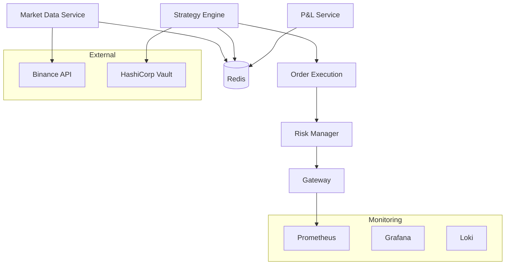

# AlphaFlow Trading Engine

A modular, security-first algorithmic trading system built with microservices architecture. AlphaFlow provides real-time market data collection, strategy execution, risk management, and comprehensive monitoring for cryptocurrency trading.

## 🏗️ Architecture



## 🚀 Services

### Core Trading Services

| Service | Language | Purpose |
|---------|----------|---------|
| **market-data** | Go | WebSocket market data collection from Binance |
| **strategy-engine** | Python | Strategy execution and backtesting |
| **order-execution** | Go | Order lifecycle management and exchange API |
| **risk-manager** | Python | Real-time risk controls and limits |
| **pnl** | Python | Real-time P&L tracking and mark-to-market |
| **gateway** | Python | API gateway and request routing |

### Built-in Trading Strategies

- **Moving Average Crossover**: Classic trend-following strategy
- **RSI Mean Reversion**: Oversold/overbought contrarian strategy  
- **Bollinger Band Squeeze**: Volatility breakout strategy

## 🛡️ Security Features

- **Zero Secrets in Code**: All credentials managed via environment variables and Vault
- **Service Authentication**: JWT-based inter-service communication
- **Input Validation**: Comprehensive schema validation for all APIs
- **Audit Logging**: Complete audit trail of all operations
- **Rate Limiting**: Protection against API abuse
- **Secret Rotation**: Automated key rotation via Vault integration

## 📊 Risk Management

### Position Controls
- Per-symbol position limits
- Total portfolio position limits
- Concentration limits (max % allocation per asset)

### Loss Protection  
- Daily loss limits
- Maximum drawdown controls
- Circuit breakers for extreme scenarios

### Real-time Monitoring
- Trade velocity limits
- Real-time risk metric calculation
- Automated alert system

## 🔧 Quick Start

### Prerequisites
- Docker & Docker Compose
- Python 3.11+
- Go 1.23+
- Make

### Setup

1. **Clone and configure**:
   ```bash
   git clone <repository-url>
   cd alphaflow-trading
   cp .env.example .env
   # Edit .env with your API keys and configuration
   ```

2. **Install dependencies**:
   ```bash
   make setup
   ```

3. **Start the stack**:
   ```bash
   make docker-up
   ```

4. **Verify services**:
   ```bash
   # Check API gateway
   curl http://localhost:8080/health
   
   # View monitoring
   open http://localhost:3000  # Grafana
   open http://localhost:9090  # Prometheus
   ```

## ⚙️ Configuration

### Environment Variables

| Variable | Description | Default |
|----------|-------------|---------|
| `BINANCE_API_KEY` | Binance API key | Required |
| `BINANCE_SECRET_KEY` | Binance secret key | Required |
| `POSITION_LIMIT_SYMBOL` | Max position per symbol | 10 |
| `POSITION_LIMIT_TOTAL` | Max total positions | 50 |
| `DAILY_LOSS_LIMIT` | Max daily loss (USD) | 1000 |
| `CONCENTRATION_LIMIT` | Max % allocation per asset | 0.5 |
| `DRAWDOWN_LIMIT` | Max drawdown threshold | 500 |

### Multi-Environment Support

```bash
# Local development
ALPHAFLOW_ENV=local

# Staging
ALPHAFLOW_ENV=staging  

# Production
ALPHAFLOW_ENV=production
```

Configuration files in `config/` directory support environment-specific settings with Vault integration for secrets.

## 📈 Trading Strategies

### Adding Custom Strategies

1. **Create strategy class**:
   ```python
   from services.strategy_engine.strategies.base import BaseStrategy
   
   class MyStrategy(BaseStrategy):
       def generate_signal(self, data: pd.DataFrame) -> Optional[Signal]:
           # Your strategy logic here
           pass
   ```

2. **Register via API**:
   ```bash
   curl -X POST http://localhost:8080/strategies \
     -H "Content-Type: application/json" \
     -d '{
       "path": "my.strategy.MyStrategy",
       "position_size": "0.1",
       "params": {"window": "20"}
     }'
   ```

### Backtesting

```python
from services.strategy_engine.backtesting import Backtester
from services.strategy_engine.strategies.moving_average import MovingAverageCrossover

# Load historical data
data = pd.read_csv("historical_data.csv")

# Create strategy
strategy = MovingAverageCrossover("MA_5_20", Decimal("0.1"), 5, 20)

# Run backtest
backtester = Backtester(slippage=Decimal("0.001"))
results = backtester.run(data, strategy)

print(f"Total P&L: {results.profit}")
print(f"Total Trades: {len(results.trades)}")
```

## 🧪 Development

### Code Quality Standards

- **Type Safety**: TypeScript for JS, type hints for Python, interfaces for Go
- **Testing**: Minimum 80% coverage, 100% for financial logic
- **Linting**: Pre-commit hooks with eslint, pylint, golangci-lint
- **Documentation**: Comprehensive docstrings for all public functions

### Running Tests

```bash
# All tests
make test

# Service-specific tests  
make test-market-data
make test-strategies
make test-risk-scenarios

# Security scans
make security-scan
```

### Pre-commit Hooks

```bash
# Install hooks
pre-commit install

# Run manually
make lint
```

## 📊 Monitoring & Observability

### Metrics Dashboard

Access Grafana at `http://localhost:3000` for:

- **Trading Performance**: P&L, win rate, drawdown
- **System Health**: Latency, throughput, error rates
- **Risk Metrics**: Position sizes, concentration, limits

### Alert Rules

Automated alerts for:
- Trading anomalies (unusual losses)
- Risk limit breaches  
- High latency (>200ms)
- Market data lag
- Service downtime

### Logging

Structured JSON logging with correlation IDs:
```bash
# View logs
docker logs alphaflow-strategy-engine

# Query with correlation ID
grep "correlation_id=abc123" /var/log/alphaflow/*.log
```

## 🚨 Operational Procedures

### Deployment

```bash
# Validate configuration
make validate-config

# Deploy monitoring stack
make deploy-monitoring

# Test alert rules
make test-alerts
```

### Emergency Procedures

1. **Circuit Breaker Activation**: Automatic trading halt on large drawdowns
2. **Manual Trading Halt**: `POST /emergency/halt` to gateway
3. **Position Liquidation**: `POST /emergency/liquidate-all`

### Backup & Recovery

- Configuration stored in Vault with versioning
- Trading data persisted to PostgreSQL with daily backups
- Redis pub/sub for real-time data (ephemeral by design)

## 🤝 Contributing

1. **Follow development standards** defined in `.codex/AGENTS.md`
2. **Create feature branches** from `develop`
3. **Ensure tests pass** and coverage requirements met
4. **Use conventional commits**: `feat(scope): description`
5. **Security review required** for all changes

## 📋 API Documentation

### Strategy Management
```bash
# List strategies
GET /strategies

# Add strategy  
POST /strategies
{
  "path": "strategies.moving_average.MovingAverageCrossover",
  "params": {"short_window": "5", "long_window": "20"},
  "position_size": "0.1"
}
```

### Risk Management
```bash
# Get portfolio status
GET /risk/portfolio

# Risk limits
GET /risk/limits
```

### Real-time Data
```bash
# WebSocket market data
ws://localhost:8080/ws/market-data

# Trading signals  
ws://localhost:8080/ws/signals
```

## 📄 License

MIT License - see [LICENSE](LICENSE) file for details.

## ⚠️ Disclaimer

This software is for educational and research purposes. Trading cryptocurrencies involves substantial risk of loss. Never trade with funds you cannot afford to lose. The authors assume no responsibility for trading losses.

---

For detailed documentation, see the `/docs` directory. For issues and feature requests, please use GitHub Issues.
